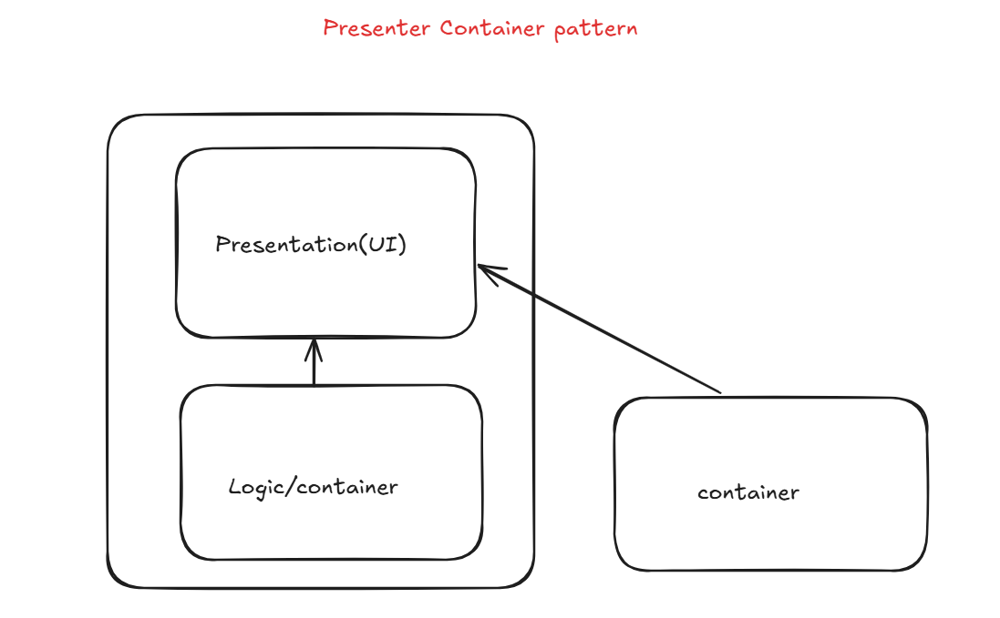

# HangMan React Project

#### Presenter container pattern

The Presenter-Container pattern is a design principle in React that helps separate UI from business logic. This pattern is particularly useful when you want to reuse the same UI in multiple components, but each instance requires different logic or data.  

